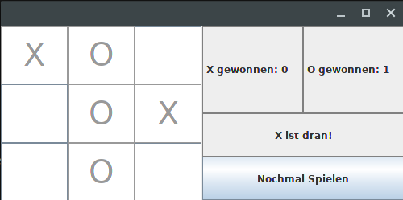
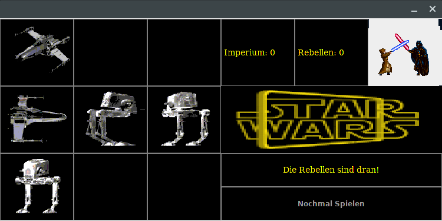

# TicTacToe
This small project was part of the authorization process for a lecture in the 3rd semester of the bioinformatics bachelor course in 2015.

Its task was to implement the game TicTacToe.

It includes a command line mode and a GUI written in Swing which has a default and a StarWars theme.

  

  

